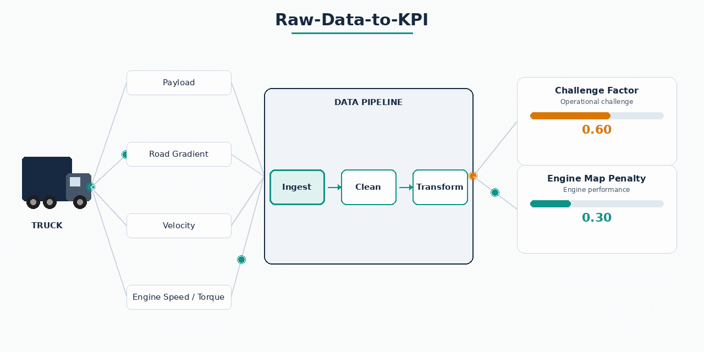
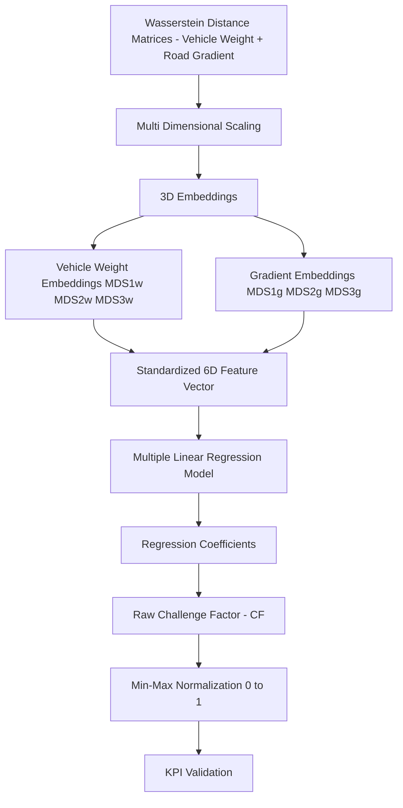
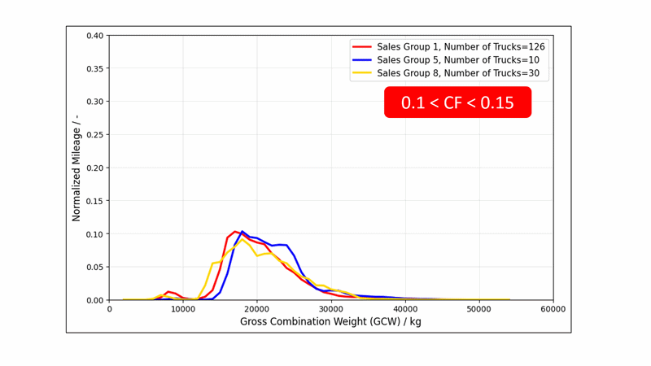
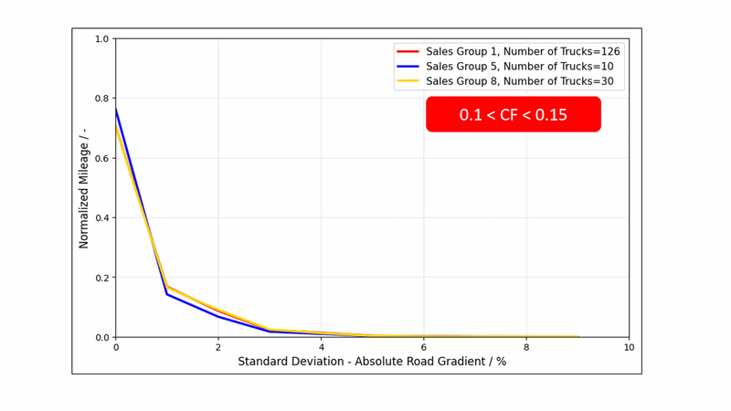
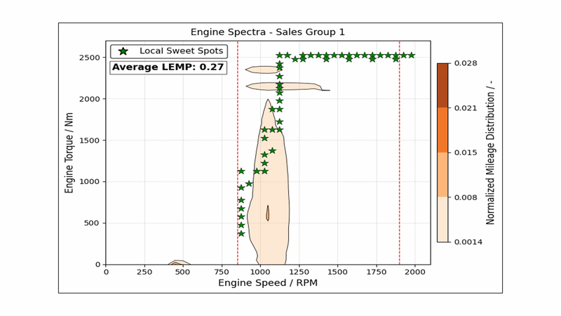

# Raw-Data-to-KPI

⭐ **1. Introduction**

Modern trucks generate large-scale telematics data (Payload, Velocity, Gradient, Engine Parameters) that is highly informative but not directly usable for analytics or cross comparison between trucks due to differences in driver usage, operating conditions 
and powertrain configurations.

This project builds a structured analytics pipeline that converts raw engine telemetry into physics-aware fleet-level KPIs. The final outputs support downstream ML, xAI and fleet performance analysis.

<table>
  <tr>
    <td align="center">
      <b></b> 
      
    </td>
  </tr>
</table>

---
🧩 **2. Challenge**

Key challenges addressed in this pipeline include:

- Defining KPIs that enable fair comparison across different vehicle types, driving styles, and operating conditions.
- Avoiding over-engineering of metrics, ensuring the KPIs remain interpretable and useful for performance assessment rather than becoming overly complex transformations.
- Ensuring physical consistency of the metrics, including meaningful scaling, units, and alignment with human intuition.
- Designing KPIs that are relevant and actionable for the commercial vehicle industry, supporting adoption by OEMs and fleet stakeholders.

---

🎯 **3. Objectives**

The 2 main objectives of this project include 
- KPI 1 (Challenge Factor) - Develop a KPI called Challenge Factor (CF) which indicates how difficult the operating condition is for the vehicle i.e. payload and road gradient.
- KPI 2 (Local Engine Map Penalty) - Develop a KPI called Local Engine Map Penalty (LEMP) which charecterizes how the pwoertrain of a particular truck responds to the presented challenge.
  i.e. Does the powertrain ensure that the challenge is covered with engine operating at its sweet spot (ideal) or is the mileage covered in engine infficient regions. 

Together these 2 KPIs whill help us charecterize for a given truck on average - How difficult are the operating conditions? and How does the powertrain deal with the presented operational challenge? 

Additionally these KPIs allow an apples to apples comparison as for example 2 trucks with a similar CF can be concluded to have same operational challenge. It is to be noted that such a conclusion cannot be made by looking at the simple averages of the payload carried 
or road gradient. Simple averages are not sufficient, since trucks may experience very different operating distributions despite having similar mean values.

---

🛠 **4. Tech Stack**

- Apache Spark (PySpark) – core engine for distributed processing of high-volume telemetry, grid construction, joins, and KPI aggregation
- Pandas / NumPy – local transformations for binning logic, interpolation, and validation steps on engine map data
- Matplotlib / Plotly – visualization of engine operation heatmaps and SFC contour surfaces for validation and diagnostics
- TALPY Time-Series Framework – supporting utilities for time-series handling, feature transformation, and structured telemetry processing
- Delta Lake / Databricks Tables – persistent storage layer for engine spectra, fuel maps, and KPI outputs across pipeline stages

---

🧠 **5. Challenge Factor (CF) - Implementation and Visualizations**

- **Wasserstein Distance** - Measures distributional differences between truck operating spectra to build a meaningful pairwise distance matrix.
- **Multi Dimensional Scaling (MDS)** - Projects high-dimensional distance relationships into a 3D embedding while preserving relative structure.
- **Multiple Linear Regression (MLR)** - Maps embedding dimensions to fuel consumption (dependent variable) to obtain interpretable coefficients for KPI construction.
- **Min-Max Normalization** - Scales the raw Challenge Factor into a bounded range [0, 1] for comparability across trucks.

The result of this pipeline is the KPI - Challenge Factor. Key highlights of the KPI include 
- The CF is always normalized to lie between 0 and 1.
- A CF of 0 represents low operational challenge (e.g., low vehicle weight and flat road conditions), while a CF of 1 represents high operational challenge (e.g., high vehicle weight and steep gradients).
- In the following visualizations, it is evident that with increasing CF, the weight profiles become more demanding (i.e., higher share of mileage at increased vehicle weights). Similarly, the gradient profiles become more demanding (i.e., lower share of mileage under flat conditions).

<table>
  <tr>
    <td align="center">
      <b> Weight Spectra Progression with increasing CF </b>  
      
    </td>
  </tr>
</table>

<table>
  <tr>
    <td align="center">
      <b> Gradient Spectra Progression with increasing CF </b>  
      
    </td>
  </tr>
</table>

How to use this KPI?
- **Enables apples-to-apples comparisons across powertrain configurations** - As shown in the visualizations for the three sales groups (representing different powertrain configurations, anonymized for confidentiality), the weight and road-gradient profiles become highly similar within a given CF interval. This indicates that the operational bias has been largely removed. Trucks grouped within the same CF range are therefore operating under comparable conditions.
- **Provides a fair basis for performance benchmarking** - Once trucks are grouped by CF, powertrain performance can be evaluated within each interval. This makes it possible to identify the best-performing powertrain configuration under comparable operating conditions and quantify the improvement potential of lower-performing configurations.

---

🧠 **6. Local Engine Map Penalty (LEMP) - Implementation and Visualizations**

<table>
  <tr>
    <td align="center">
      <b> Engine Spectra Progression with increasing LEMP </b>  
      
    </td>
  </tr>
</table>

---

