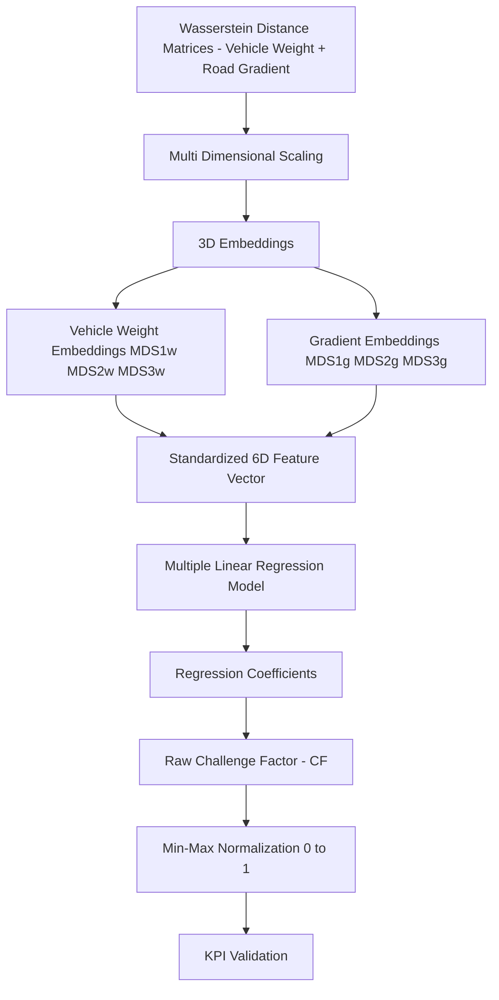
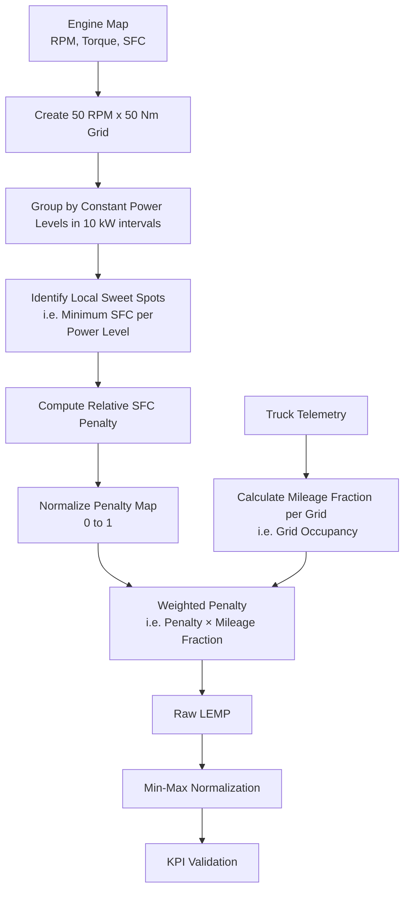

# Raw-Data-to-KPI

[Data Analysis Tool] End-to-end pipeline for converting raw vehicle telemetry data into operational challenge and powertrain performance KPIs.

---

# Contents

⭐ [ 1. Introduction](#-1-introduction)  
🧩 [ 2. Challenge](#-2-challenge)  
🎯 [ 3. Objectives](#-3-objectives)  
🛠  [ 4. Tech Stack](#-4-tech-stack)  
🧠  [ 5. Challenge Factor - Implementation](#-5-challenge-factor-cf---implementation-and-visualizations)  
🧠  [ 6. Engine Map Penalty - Implementation](#-6-local-engine-map-penalty-lemp---implementation-and-visualizations)  
📊  [ 7. Project Outcomes - Key Numbers](#-7-project-outcomes---key-numbers)  
🧭  [ 8. Future Extensions](#-8-future-extensions)  
⚠️  [ 9. Data Note](#%EF%B8%8F-9-data-note)  
👨‍💻  [ 10. Skills Demonstrated](#%E2%80%8D-10-skills-demonstrated)  

---

# ⭐ **1. Introduction**

Modern trucks generate large-scale telematics data (Payload, Velocity, Gradient, Engine Parameters) that is highly informative but not directly usable for analytics or cross comparison between trucks due to differences in driver usage, operating conditions 
and powertrain configurations.

This project builds a structured analytics pipeline that converts raw engine telemetry into physics-aware fleet-level KPIs. The final outputs support downstream ML, xAI and fleet performance analysis.

<table>
  <tr>
    <td align="center">
      <b></b> 
      
    </td>
  </tr>
</table>

---
# 🧩 **2. Challenge**

Key challenges addressed in this pipeline include:

- Defining KPIs that enable fair comparison across different vehicle types, driving styles, and operating conditions.
- Avoiding over-engineering of metrics, ensuring the KPIs remain interpretable and useful for performance assessment rather than becoming overly complex transformations.
- Ensuring physical consistency of the metrics, including meaningful scaling, units, and alignment with human intuition.
- Designing KPIs that are relevant and actionable for the commercial vehicle industry, supporting adoption by OEMs and fleet stakeholders.

---

# 🎯 **3. Objectives**

The 2 main objectives of this project include 
- KPI 1 (Challenge Factor) - Develop a KPI called Challenge Factor (CF) which indicates how difficult the operating condition is for the vehicle i.e. payload and road gradient.
- KPI 2 (Local Engine Map Penalty) - Develop a KPI called Local Engine Map Penalty (LEMP) which charecterizes how the pwoertrain of a particular truck responds to the presented challenge.
  i.e. Does the powertrain ensure that the challenge is covered with engine operating at its sweet spot (ideal) or is the mileage covered in engine infficient regions. 

Together these 2 KPIs whill help us charecterize for a given truck on average - How difficult are the operating conditions? and How does the powertrain deal with the presented operational challenge? 

Additionally these KPIs allow an apples to apples comparison as for example 2 trucks with a similar CF can be concluded to have same operational challenge. It is to be noted that such a conclusion cannot be made by looking at the simple averages of the payload carried 
or road gradient. Simple averages are not sufficient, since trucks may experience very different operating distributions despite having similar mean values.

---

# 🛠 **4. Tech Stack**

- Apache Spark (PySpark) – core engine for distributed processing of high-volume telemetry, grid construction, joins, and KPI aggregation
- Pandas / NumPy – local transformations for binning logic, interpolation, and validation steps on engine map data
- Matplotlib / Plotly – visualization of engine operation heatmaps and SFC contour surfaces for validation and diagnostics
- TALPY Time-Series Framework – supporting utilities for time-series handling, feature transformation, and structured telemetry processing
- Delta Lake / Databricks Tables – persistent storage layer for engine spectra, fuel maps, and KPI outputs across pipeline stages

---

# 🧠 **5. Challenge Factor (CF) - Implementation and Visualizations**

- **Wasserstein Distance** - Measures distributional differences between truck operating spectra to build a meaningful pairwise distance matrix.
- **Multi Dimensional Scaling (MDS)** - Projects high-dimensional distance relationships into a 3D embedding while preserving relative structure.
- **Multiple Linear Regression (MLR)** - Maps embedding dimensions to fuel consumption (dependent variable) to obtain interpretable coefficients for KPI construction.
- **Min-Max Normalization** - Scales the raw Challenge Factor into a bounded range [0, 1] for comparability across trucks.

The result of this pipeline is the KPI - Challenge Factor. Key highlights of the KPI include 
- The CF is always normalized to lie between 0 and 1.
- A CF of 0 represents low operational challenge (e.g., low vehicle weight and flat road conditions), while a CF of 1 represents high operational challenge (e.g., high vehicle weight and steep gradients).
- In the following visualizations, it is evident that with increasing CF, the weight profiles become more demanding (i.e., higher share of mileage at increased vehicle weights). Similarly, the gradient profiles become more demanding (i.e., lower share of mileage under flat conditions).

<table>
  <tr>
    <td align="center">
      <b> Weight Spectra Progression with increasing CF </b>  
      
    </td>
  </tr>
</table>

<table>
  <tr>
    <td align="center">
      <b> Gradient Spectra Progression with increasing CF </b>  
      
    </td>
  </tr>
</table>

How to use this KPI?
- **Enables apples-to-apples comparisons across powertrain configurations** - As shown in the visualizations for the three sales groups (representing different powertrain configurations, anonymized for confidentiality), the weight and road-gradient profiles become highly similar within a given CF interval. This indicates that the operational bias has been largely removed. Trucks grouped within the same CF range are therefore operating under comparable conditions.
- **Provides a fair basis for performance benchmarking** - Once trucks are grouped by CF, powertrain performance can be evaluated within each interval. This makes it possible to identify the best-performing powertrain configuration under comparable operating conditions and quantify the improvement potential of lower-performing configurations.

---

# 🧠 **6. Local Engine Map Penalty (LEMP) - Implementation and Visualizations**

- **Specific Fuel Consumption (g/ kWh)** - Fuel required to generate a unit of engine power; lower values indicate higher efficiency.
- **Engine Sweet Spot** - The most fuel-efficient operating point for a given power demand.
- **Penalty Map** - A normalized map quantifying the efficiency loss associated with operating away from local sweet spots.
- **Local Engine Map Penalty (LEMP)** - A KPI that measures how efficiently a powertrain operates by evaluating how closely engine operating points align with the engine's most efficient regions.

The result of this pipeline is the KPI - Local Engine Map Penalty. Key highlights of the KPI include 
- LEMP is normalized to the range [0,1].
- Lower LEMP values indicate that most mileage is accumulated near the engine's local sweet spots.
- Higher LEMP values indicate operation in less efficient regions of the engine map.
- LEMP is intended to compare different powertrain configurations operating under similar Challenge Factor (CF) conditions.
- The green stars indicate the local engine sweet spots at each power level, while the heat map represents mileage distribution across the engine map. A higher concentration of mileage near the sweet spots results in a lower LEMP, whereas mileage farther from the sweet spots leads to a higher penalty. The examples below compare three sales groups operating at the same Challenge Factor (CF), highlighting how different powertrain configurations handle the same operational challenge.
  
<table>
  <tr>
    <td align="center">
      <b> Engine Spectra Progression with increasing LEMP </b>  
      
    </td>
  </tr>
</table>

How to use this KPI?

- **Compare powertrain efficiency under equivalent operating conditions** - Trucks with similar CF values experience comparable operational challenges, enabling fair comparison of LEMP across powertrain configurations.
- **Identify inefficient configurations** - Higher LEMP values indicate that the powertrain spends more time away from the engine's optimal operating regions.
- **Support powertrain optimization** - Differences in LEMP can reveal opportunities for improving engine sizing, transmission selection, or axle ratio matching for a given duty cycle.

---

# 📊 **7. Project Outcomes - Key Numbers**

This pipeline operates at commercial fleet scale and processes large-scale telematics data:

• 🚛 21,000+ commercial trucks analyzed  
• 🧑 300+ individual customers analyzed  
• ⚙️ 400 billion+ time-series records transformed into structured analytics features   
• 📡 30+ telemetry signals processed per vehicle   
• 📊 15 powertrain configurations evaluated (SG1–SG15)   
• 🧠 2 key KPIs developed enabling separation of operational difficulty and powertrain efficiency for large-scale, comparable fleet analysis  
• ⚖️ [0,1] All KPIs normalized to, enabling consistent fleet-wide comparison across operating conditions  
• 📉 0.02–0.04 – Low MDS stress, indicating only ~2–4% relative distortion (interpreted as minimal information loss) in preserving pairwise distances during dimensionality reduction

---

# 🧭 **8. Future Extensions**

Potential next-stage enhancements for this pipeline include:
 - 🔍 **CF–LEMP joint analysis** - can be used to further explain performance differences between powertrain groups under identical operational conditions by separating operational challenge (CF) from efficiency response (LEMP).
 - ⛽ **LEMP–fuel consumption analysis** - enables investigation of the relationship between engine operating efficiency and real-world fuel consumption behavior.
 - 💰 **LEMP–TCO modeling** - can be extended to quantify the impact of engine efficiency on total cost of ownership at customer level.

---

# ⚠️ **9. Data Note**

This project uses proprietary internal datasets from a commercial automotive manufacturer.
Only the processing pipeline and code structure are shared in this repository for demonstration and learning purposes.
No raw or sensitive data is included.

---

# 👨‍💻 **10. Skills Demonstrated**

- End-to-end statistical KPI design, transforming raw fleet telemetry into interpretable metrics (CF & LEMP).
- Distance-based machine learning (Wasserstein + MDS) for high-dimensional operational behavior embedding.
- Interpretable modeling using Multiple Linear Regression for KPI construction and feature attribution.
- Fleet-level analytics & benchmarking framework enabling fair comparison of powertrain performance under controlled operational conditions

---

